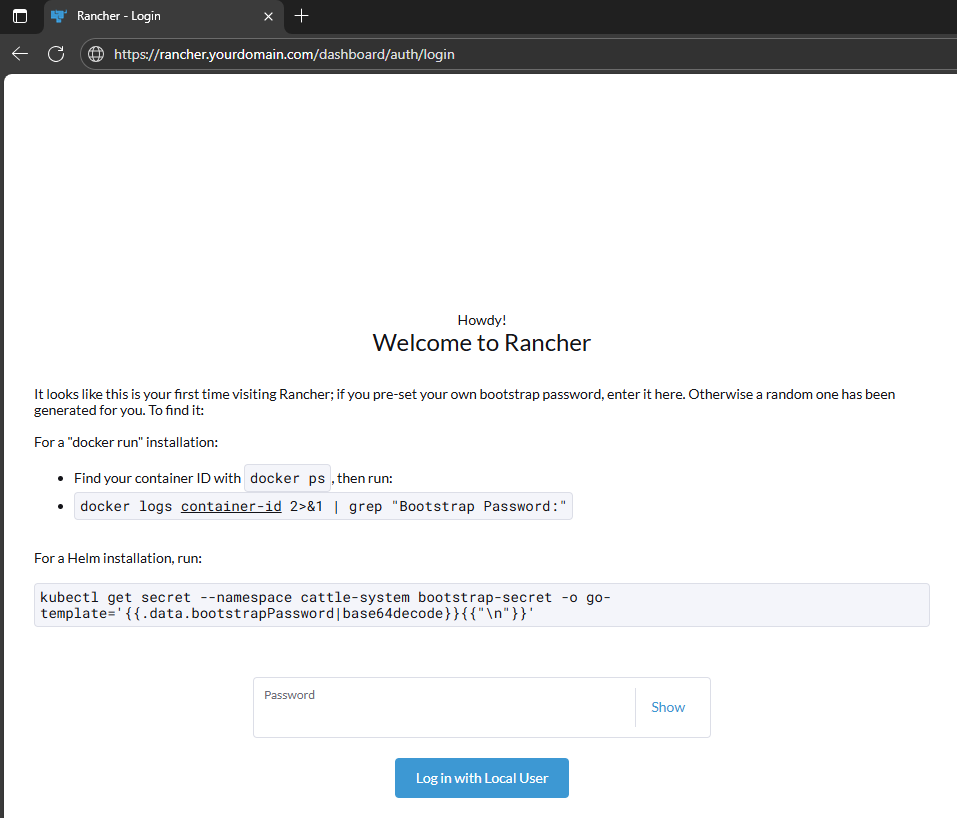

# terraform-k8s-rancher project

This project uses Terraform to provision all necessary AWS resources for the Kubernetes and Rancher environment.
The deployment process can be executed manually using Terraform commands, or automatically through the GitHub Actions pipeline configured in this repository.

# Considerations
Before running Terraform (either locally or through the pipeline), ensure the following:

### AWS Account
The AWS account must allow creation of EKS, VPC, IAM, and related resources.

### S3 Backend
The Terraform S3 backend is a remote backend configuration that stores the Terraform state file in an Amazon S3 bucket, you must have it configured.

In the backend.tf file specify the name of the respective bucket.
```terraform
terraform {
  backend "s3" {
    bucket       = "NameBucket"
    key          = "terraform.tfstate"
    region       = "us-east-1"
    encrypt      = true
    use_lockfile = true
  }
}
```

### IAM Role 
#### Role for terraform
If the project needs to be executed locally, first create an IAM role in the AWS account with the necessary permissions for VPC and EKS services.
This role will then be assumed by Terraform during execution, as defined in the provider configuration

In the provider.tf specify the arn of the respective role for terraform.
```terraform
provider "aws" {
  region = "us-east-1"
  assume_role {
    role_arn = "arn:aws:iam::accountid:role/namerole"
  }
}
```

#### Role for GitHub Actions
In order to execute the project using  GitHub Actions, you must also provision an IAM role.
The role is assumed via an OpenID Connect (OIDC) Identity Provider that establishes a trust relationship between the GitHub repository and AWS account.

In the tf-deploy-to-main.yml specify the arn of the respective role for gitactions.
```yaml
 - name: Configure AWS credentials
        uses: aws-actions/configure-aws-credentials@v4
        with:
          role-to-assume: arn:aws:iam::accountid:role/nameroleforgiactions
          role-session-name: GitHub_to_AWS_via_FederatedOIDC
          aws-region: us-east-1
```

#### Necesary Versions
Terraform Version: >= 1.73.0

AWS CLI: >= 2.0

Helm : >= 4.0.0

# Deploy Rancher Using Helm commands

If the infrastructure has been successfully provisioned with Terraform, follow these steps to configure and deploy Rancher on the EKS cluster.

### Connect to the EKS Cluster

Use the following command to update the local kubeconfig file and connect to the  EKS cluster:
```bash
 aws eks update-kubeconfig --region us-east-1 --name terraform-k8s-rancher-Cluster-Prod
```

### Install the Required CRDs for cert-manager

Before installing cert-manager via Helm, apply its Custom Resource Definitions (CRDs):
```bash
kubectl apply -f https://github.com/cert-manager/cert-manager/releases/download/v1.19.0/cert-manager.crds.yaml
```


### Add the Helm Repositories

Add the necessary Helm repositories for cert-manager, Rancher, and NGINX Ingress:
```bash
helm repo add jetstack https://charts.jetstack.io
helm repo add rancher-stable https://releases.rancher.com/server-charts/stable
helm repo add ingress-nginx https://kubernetes.github.io/ingress-nginx
```

### Update Helm Repository Cache
```bash
helm repo update
```

5. Install cert-manager

Install the cert-manager Helm chart, which handles certificate issuance for Rancher:

```bash
helm install \
  cert-manager jetstack/cert-manager \
  --namespace cert-manager \
  --create-namespace \
  --version v1.19.0
```

### Retrieve the Load Balancer DNS

The Ingress Controller is deployed, retrieve the Load Balancer DNS name to associate it with your domain:

```bash
kubectl get svc -n ingress-nginx | grep -i 'LoadBalancer'
```
Note:
In your domain’s DNS management console, create a CNAME record that points your chosen Rancher hostname (e.g., rancher.yourdomain.com) to the DNS name of the Load Balancer retrieved in the previous step.

### Install Rancher

Deploy Rancher into the EKS cluster using Helm:
```bash
helm install rancher rancher-stable/rancher \
  --namespace cattle-system \
  --create-namespace \
  --set hostname=rancher.yourdomain.com \
  --set bootstrapPassword=admin
  ```

### Set the Ingress Class for Rancher

Ensure that Rancher’s Ingress resource uses the NGINX Ingress Controller by setting its ingress class:
```bash
kubectl patch ingress rancher -n cattle-system -p '{"spec": {"ingressClassName": "nginx"}}'
```

Using the domain the Rancher panel is accessed


### Additional Consideration

In this project, Rancher was deployed using direct Helm commands for simplicity and demonstration purposes.
However, in a more robust and production-oriented environment, it is recommended to adopt a GitOps approach using Argo CD to manage Helm releases.